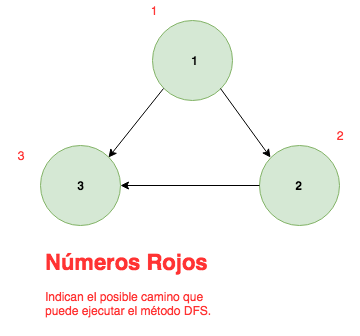

# Control 2

### Verdadero o False (3 puntos)
Todas las preguntas tienen 0.6 puntos. En el caso de las falsas:
  - Si una pregunta está correcta pero mal justificada serán 0.1 puntos.
  - Si una pregunta está correcta pero con justificación incompleta serán 0.3 puntos.
  - Si una pregunta está correcta y bien justificada se otrogará el puntaje completo.

1. Un árbol es también un grafo.

    **Respuesta:** Verdadero. (0.6 puntos)

2. En DFS cada vez que se va desde un nodo a otro es mediante el camino más corto.

    **Respuesta:** Falso. Basta con un contra ejemplo. _'Suponga un grafo con tres nodos 1, 2 y 3, donde 1 está conectado con 2 y 3, y 2 está conectado con 3. El algoritmo DFS podría ir de 1 a 3 a través del siguiente camino: 1 &rightarrow; 2 &rightarrow; 3, mientras el camino más corto es 1 &rightarrow; 3.'_. (0.6 puntos)

3. El algoritmo BFS se podría relacionar con una cola, y DFS con un stack.

    **Respuesta:** Verdadero. (0.6 puntos)

4. La matriz de adyacencia de un grafo es siempre cuadrada y simétrica (M[i][j] = M[j][i] para todo `i,j` en el rango de la   matriz M).

    **Respuesta:** Falso. Eso sólo se cumple en el caso de un grafo no dirigido. En caso contrario,
    la matriz podría no ser simétrica. (0.6 puntos)

5. Las matrices de incidencia de un grafo son siempre cuadradas.

    **Respuesta:** Falso. Eso sólo se cumple si es que el número de vértices es el mismo que el de
    aristas, lo cual no es cierto. Es posible probarlo con un contraejemplo. (0.6 puntos)


### Lectura de código (3 pts):

Explique cómo funciona el método `foo` e imprima el output generado por el main entregado.

```python
class Node:


    def __init__(self, data):
        self.data = data
        self.next = None

    def __str__(self):
        return 'N{}'.format(str(self.data))


class BarList:


    def __init__(self):
        self.head = self.tail = None
        self._len = 0

    def append(self, data):
        node = Node(data)
        if not len(self):
            self.head = self.tail = node

        tail = self.tail
        tail.next = node
        self.tail = node
        self._len += 1

    def __len__(self):
        return self._len

    def __str__(self):
        nodes, current = [], self.head
        while current:
            nodes.append(str(current))
            current = current.next

        # '@'.join(['a', 'b', 'c', 'def']) retorn 'a@b@c@def'
        return '->'.join(nodes)

    def foo(self, data, node=None):
        if node is None:
            node = self.head
        if node.data == data:
            return node
        if node.next is None:
            return None
        self.foo(data, node.next)


if __name__ == '__main__':
    # Los valores pueden valriar entre cada forma
    bar = BarList()
    bar.append(3)
    bar.append(1)
    bar.append(4)
    print(bar)
    print(len(bar))

    print(bar.foo(3))
    print(bar.foo(2))
    print(bar.foo(1))
```

- El objetivo general de `foo` (1 punto):
    Es retornar, de forma recursiva, el primer nodo únicamente si calza con el valor de `value`. Si éste no es el primer nodo o el valor no existe, entonces devolverá `None`.
    También es posible decir que el método intenta buscar recursivamente el nodo, pero falla por la ausencia del `return` al llamar al método nuevamente.


**Para esta parte el output excato dependerá de la forma que haya hecho el alumno, sin embargo, es análogo**
- Mismo puntaje para cada output correcto.
    - `N1->N3->N4` porque así está definido en el `__str__`
    - 3 porque es la cantidad de nodos en la lista
    - `N1` el valor existe en la lista y es el primero
    - `None` el valor 2 no existe en la lista
    - `None` el valor existe, sin embargo, por falta del `return` `python` devolverá `None` por defecto
